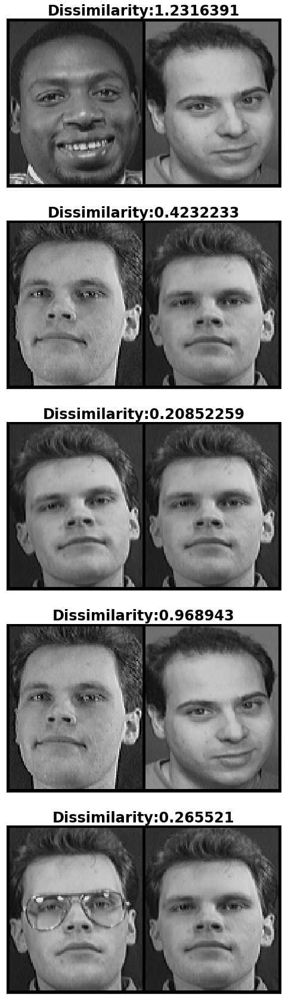

# Project Description

This is a simple implementation of Contrastive Loss for One-Shot Learning. The original images were of size 92x112 pixels. The model learnt the 128-dimensional embedding space for these images while being trained to decrease the euclidean distance (dissimilarity) between images of the same class (in this case faces of the same person) and simultaneously increase the euclidean distance between images of different classes. Results can be seen below

## Dataset Used
[AT&T Database of Faces](https://www.kaggle.com/kasikrit/att-database-of-faces)<br>
Out of the 40 faces available within the dataset, 32 were used for training the model, 4 for validation, and the remaining 4 were treated as "unseen data" for one shot classification.

## File Descriptions

- ```split.py``` - Script to segregate classes into train-val-test
- ```loss.py``` - Class definition of Contrastive Loss
- ```dataset.py``` - Class definition of dataset for Contrastive Loss.
- ```model.py``` - Class definition of SiameseNetwork Model
- ```utils.py``` - Helper functions
- ```main.ipynb``` - Main script to proceed with training.


## Results



## Dependencies

- PyTorch 1.4.0
- Python 3.7.6
